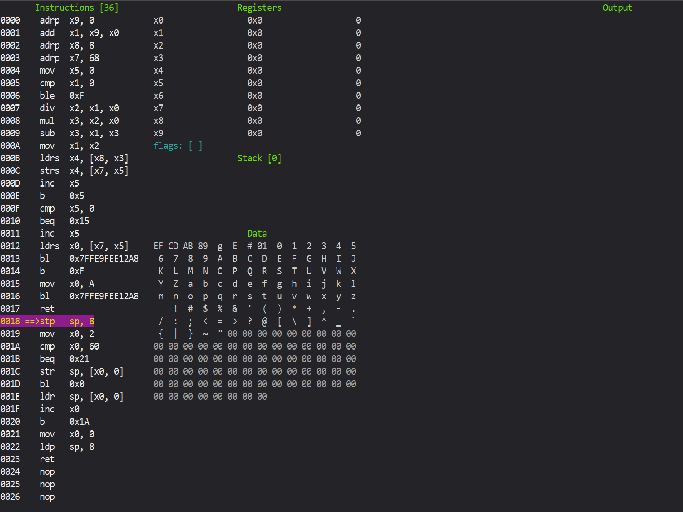

# ToyVM

ToyVM is a custom assembly compiler and a simple virtual machine/interpreter to execute the code. It runs on Windows, Linux, and OSX. It supports linking c/c++ dynamic libraries through a simple plugin interface.

There are three main programs in the repository.

* tcom
* tvm
* tdbg

## tcom

Is the assembly compiler.

### tcom Usage

```txt
tcom <options> <input file>

   options:
      -h show this message.
      -o output file.
      -l link library.
      -d disable full path when reporting errors.
      -m print the module path and exit.
```

* -l Links a shared library into the file.
* -m Displays the location of the shared library folder.
* -d Is used in the tests to prevent full path names from being reported, which would cause them to fail.

## tvm

tvm runs the executable file generated by tcom.

### tvm Usage

```txt
tvm <options> <program_path>

   options:
      -h display this message.
      -t display execution time.
      -m print the module path and exit.
```

## tdbg

tdbg is an experimental debugger.

It is disabled by default because the Linux and Mac versions use ncurses for the display which may or may not be installed. ```-DBUILD_DBG=ON``` will enable it.

It can be obtained using:

```txt
sudo apt-get install libncurses-dev
```

It has been tested with ```(6.2-0ubuntu2).```

### tdbg Usage

```txt
tdbg <options> <program_path>

  options:
      -h display this message.

  Usage:
       Q - display exit screen.
       C - continue until the next breakpoint.
       B - add a break point on the current instruction.
       Down Arrow - step one instruction.

```



### Current Documentation

Documentation can be found [here.](Codes.md)

## Building

Building with CMAKE and make.

```txt
mkdir Build
cd Build
cmake ..
make
```

Testing and Installing.

```txt
mkdir Build
cd Build
cmake -DToyVM_INSTALL_PATH=<some install directory> -DBUILD_TEST=ON ..
make
make install
```
